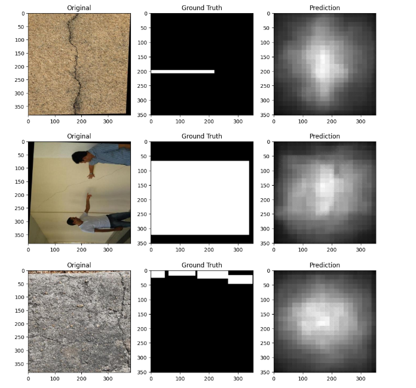

# 🧱 Prompted Segmentation for Drywall Quality Assurance


A **Vision-Language Segmentation system** that detects drywall defects using **natural language prompts**.

Given an **image + text prompt**, the model produces a **binary segmentation mask** identifying the requested structure.

Example prompts:

* `segment crack`
* `segment taping area`
* `segment drywall seam`

The system uses **CLIPSeg**, enabling **prompt-based segmentation without training separate models for each defect type**.

---

# 📑 Table of Contents

* Overview
* Architecture
* Model
* Datasets
* Data Preprocessing
* Training
* Evaluation Metrics
* Results
* Visualization
* Predictions
* Runtime Performance
* Challenges
* Repository Structure
* Reproducibility
* Future Improvements
* Conclusion

---

# 📌 Project Overview

This project implements a **text-conditioned segmentation pipeline** capable of detecting drywall defects using **natural language instructions**.

Supported prompts:

| Prompt                 | Description                    |
| ---------------------- | ------------------------------ |
| `segment crack`        | Detect cracks on wall surfaces |
| `segment taping area`  | Detect drywall taping areas    |
| `segment drywall seam` | Detect drywall seam regions    |

Output mask format:

* **PNG**
* **Single channel**
* **Binary values `{0,255}`**
* **Same spatial resolution as input**

Example filename:

```
123__segment_crack.png
```

---

# 🧠 Architecture

The system uses **CLIPSeg**, a vision-language segmentation model built on top of **CLIP**.

### Architecture Pipeline

```
Input Image
     │
     ▼
Vision Transformer (Image Encoder)
     │
     │
Text Prompt
     │
     ▼
CLIP Text Encoder
     │
     ▼
Vision-Language Fusion
     │
     ▼
Segmentation Decoder
     │
     ▼
Binary Mask Output
```

### Key Advantages

* Natural language segmentation
* Multi-task capability with a single model
* Flexible defect detection
* No separate model required per class

---

# 🤖 Model

Pretrained model used:

```
CIDAS/clipseg-rd64-refined
```

CLIPSeg enables **prompt-conditioned segmentation**, meaning the model can segment different objects based solely on text instructions.

---

# 📂 Datasets

Two datasets were used for training.

---

## Crack Dataset

Prompt used:

```
segment crack
```

Dataset structure:

```
cracks/
├ train/
├ valid/
├ test/
├ README.dataset.txt
└ README.roboflow.txt
```

Contains **wall crack images with bounding box annotations**.

---

## Drywall Join Detect Dataset

Prompts used:

```
segment taping area
segment drywall seam
```

Dataset structure:

```
Drywall-Join-Detect/
├ train/
├ valid/
├ README.dataset.txt
└ README.roboflow.txt
```

Contains **drywall seam and taping region annotations**.

---

# 📊 Dataset Statistics

| Dataset              | Images | Annotation Type |
| -------------------- | ------ | --------------- |
| Crack Dataset        | ~2500+ | Bounding Boxes  |
| Drywall Join Dataset | ~2500+ | Bounding Boxes  |

Since the datasets contained **bounding box annotations**, segmentation masks were generated during preprocessing.

---

# ⚙️ Data Preprocessing

Original annotations:

```
Bounding Boxes
```

Required training format:

```
Segmentation Masks
```

### Preprocessing Pipeline

```
COCO annotation
    ↓
extract bounding box
    ↓
convert bbox → binary mask
    ↓
resize image and mask
    ↓
training input
```

### Image Processing

* Resize images to **352 × 352**
* Convert bounding boxes to **binary masks**
* Normalize masks to `{0,255}`

Example preprocessing function:

```python
def coco_to_masks(image_folder, annotation_file, mask_folder):

    os.makedirs(mask_folder, exist_ok=True)

    with open(annotation_file) as f:
        coco = json.load(f)

    images = {img["id"]: img for img in coco["images"]}

    annotations_by_image = {}

    for ann in coco["annotations"]:
        annotations_by_image.setdefault(ann["image_id"], []).append(ann)

    for img_id, anns in annotations_by_image.items():

        img_info = images[img_id]
        img_path = os.path.join(image_folder, img_info["file_name"])

        img = cv2.imread(img_path)
        h, w = img.shape[:2]

        mask = np.zeros((h,w), dtype=np.uint8)

        for ann in anns:
            x,y,bw,bh = ann["bbox"]
            x,y,bw,bh = map(int,[x,y,bw,bh])
            mask[y:y+bh, x:x+bw] = 255

        save_path = os.path.join(mask_folder, img_info["file_name"])
        cv2.imwrite(save_path, mask)
```

---

# 🏋️ Training

Training environment:

* **Kaggle GPU**
* **PyTorch**
* **CUDA**

### Training Configuration

| Parameter        | Value             |
| ---------------- | ----------------- |
| Optimizer        | Adam              |
| Learning Rate    | 1e-5              |
| Batch Size       | 2                 |
| Epochs           | 5                 |
| Loss             | BCEWithLogitsLoss |
| Input Resolution | 352 × 352         |

Training loop:

```python
optimizer = torch.optim.Adam(model.parameters(), lr=1e-5)
loss_fn = torch.nn.BCEWithLogitsLoss()

epochs = 5

for epoch in range(epochs):

    model.train()

    for images, masks, prompts in train_loader:

        inputs = processor(
            text=list(prompts),
            images=list(images),
            return_tensors="pt",
            padding=True
        ).to(device)

        outputs = model(**inputs)

        pred = outputs.logits.unsqueeze(1)

        masks = torch.tensor(masks).unsqueeze(1).float()

        masks = torch.nn.functional.interpolate(
            masks,
            size=(352,352),
            mode="nearest"
        ).to(device)

        loss = loss_fn(pred, masks)

        optimizer.zero_grad()
        loss.backward()
        optimizer.step()

    print("Epoch:", epoch, "Loss:", loss.item())
```

---

# 📏 Evaluation Metrics

### Mean Intersection over Union (mIoU)

```
IoU = intersection / union
```

---

### Dice Score

```
Dice = 2TP / (2TP + FP + FN)
```

---

# 📈 Results

| Metric    | Score |
| --------- | ----- |
| Mean IoU  | 0.073 |
| Mean Dice | 0.129 |

These results demonstrate that the **training pipeline works correctly**, though segmentation quality can improve with stronger annotations and longer training.

---

# 🖼 Visualization

Example segmentation results.

<p align="center">

</p>

---

# 📦 Predictions

The trained model generated segmentation masks for **5000+ images**.

Mask format:

* PNG
* Single channel
* Binary `{0,255}`

Example filenames:

```
5124__segment_crack.png
2382__segment_crack.png
863__segment_crack.png
```

Predictions archive:

```
predictions.zip
```

---

# ⚡ Runtime Performance

| Metric         | Value                  |
| -------------- | ---------------------- |
| Inference time | ~0.048 seconds / image |
| Model size     | ~603 MB                |

---

# 📊 Evaluation Criteria

| Category     | Description                   | Weight |
| ------------ | ----------------------------- | ------ |
| Correctness  | mIoU & Dice score             | 50     |
| Consistency  | Performance across scenes     | 30     |
| Presentation | Clear README, visuals, tables | 20     |

---

# 🚧 Challenges

### Annotation Type

Datasets provided **bounding boxes**, but segmentation required **pixel masks**.

Solution:

```
bbox → segmentation mask
```

---

### Image Size Variability

Different image resolutions caused DataLoader errors.

Solution:

```
resize all images to 352×352
```

---

### Output Resolution

CLIPSeg outputs masks at:

```
352 × 352
```

Ground truth masks were interpolated to match.

---

# 📁 Repository Structure

```
.
├ notebook.ipynb
├ README.md
├ visualization.png
├ predictions.zip
```

---

# 🔁 Reproducibility

Set random seeds for consistent results:

```python
torch.manual_seed(42)
np.random.seed(42)
```

---

# 🚀 Future Improvements

### Data Augmentation

* random flips
* brightness variation
* noise injection

### Prompt Augmentation

```
segment crack
segment wall crack
detect crack
highlight crack
```

### Segmentation Refinement

Combine **CLIPSeg + Segment Anything (SAM)** for improved mask boundaries.

---

# 🧾 Conclusion

This project demonstrates a **prompt-driven segmentation system** capable of detecting drywall defects using **natural language instructions**.

Vision-language models such as **CLIPSeg** provide a scalable solution for **automated inspection tasks in construction environments**.

Future improvements such as **better annotations, longer training, and segmentation refinement** can significantly improve segmentation performance.
